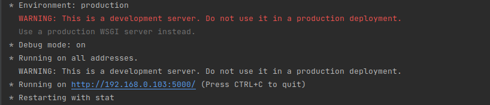

# **Project Idea**

The proposed project approaches the problem of Facial Expression Recognition, which has been a subject of interest in the Artificial Intelligence field for a long time, given its various use cases from self-driving cars to game testing.

Our implementation consists of a Deep Learning model, which tries to classify images containing facial expressions belonging to 7 classes: angry, disgust, fear, happy, neutral, sad, surprise. The model uses the FER-2013 dataset (https://www.kaggle.com/msambare/fer2013). It achieved 61% validation accuracy and 65% training accuracy. 

The project also implements a Flask app for serving these predictions, with a simple HTML page as the GUI. If a webcam is present on your device, it automatically opens it and returns real-time predictions. 

# **How to run it**

* Clone the project using git clone https://github.com/cass12/Facial-Expression-Recognition.git 
* Open your favourite JetBrains IDE and setup a virtual enviroment as explained here:
    https://www.jetbrains.com/help/pycharm/pipenv.html (this will automatically install project dependencies for you)
* Run the **main.py** script: 
    - this will output in the terminal a link which opens the HTML page 
        
    - click on the link, and this will automatically open your webcam and return real-time predictions based on your facial expression

# **References** 
https://github.com/amilkh/cs230-fer

https://gist.github.com/asterisk37n/20b9a36cda32f2e72e4093a1ef9936ab

https://analyticsindiamag.com/my-first-cnn-project-emotion-detection-using-convolutional-neural-network-with-tpu/ 

https://medium.com/swlh/how-to-use-smote-for-dealing-with-imbalanced-image-dataset-for-solving-classification-problems-3aba7d2b9cad 

https://vijayabhaskar96.medium.com/tutorial-image-classification-with-keras-flow-from-directory-and-generators-95f75ebe5720

https://medium.com/techcrush/how-to-render-html-file-in-flask-3fbfb16b47f6

https://towardsdatascience.com/camera-app-with-flask-and-opencv-bd147f6c0eec

https://towardsdatascience.com/video-streaming-in-web-browsers-with-opencv-flask-93a38846fe00

https://www.bogotobogo.com/python/OpenCV_Python/python_opencv3_Image_Object_Detection_Face_Detection_Haar_Cascade_Classifiers.php